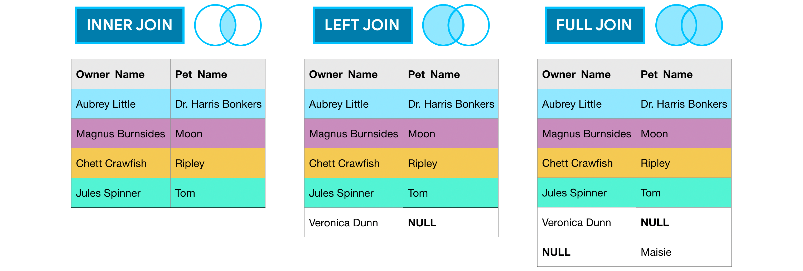
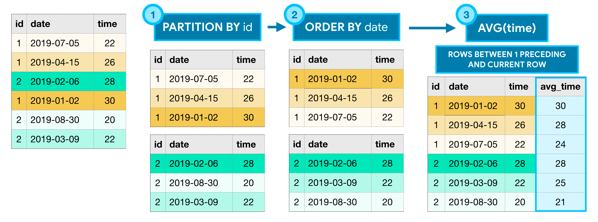

# Kaggle Advanced SQL Notes

## Section 1 — JOINs and UNIONs



## JOIN idea

`JOIN` combines tables **horizontally**.

Meaning:

```text
JOIN = add columns from another table
```

Example:

```sql
SELECT 
    o.Name AS owner_name,
    p.Name AS pet_name
FROM `project.dataset.owners` AS o
INNER JOIN `project.dataset.pets` AS p
    ON o.Pet_ID = p.ID;
```

`ON` tells SQL how to match rows from the two tables.

---

## INNER JOIN

Returns only matching rows from both tables.

```sql
SELECT *
FROM table1 AS a
INNER JOIN table2 AS b
    ON a.id = b.id;
```

Use when you only want rows that exist in both tables.

---

## LEFT JOIN

Returns:

```text
all rows from left table
+ matching rows from right table
```

If no match exists, right-side columns become `NULL`.

```sql
SELECT *
FROM table1 AS a
LEFT JOIN table2 AS b
    ON a.id = b.id;
```

Use when you want to keep all rows from the first table.

---

## RIGHT JOIN

Returns:

```text
all rows from right table
+ matching rows from left table
```

If no match exists, left-side columns become `NULL`.

```sql
SELECT *
FROM table1 AS a
RIGHT JOIN table2 AS b
    ON a.id = b.id;
```

Usually, `LEFT JOIN` is easier to read, so many people rewrite right joins as left joins.

---

## FULL JOIN

Returns all rows from both tables.

If a row has no match, missing side columns become `NULL`.

```sql
SELECT *
FROM table1 AS a
FULL JOIN table2 AS b
    ON a.id = b.id;
```

Use when you want to keep everything from both tables.

---

## JOIN example with CTE

Task: show stories from January 1, 2012 with number of comments.

```sql
WITH c AS (
    SELECT 
        parent,
        COUNT(*) AS num_comments
    FROM `bigquery-public-data.hacker_news.comments`
    GROUP BY parent
)
SELECT 
    s.id AS story_id,
    s.by,
    s.title,
    c.num_comments
FROM `bigquery-public-data.hacker_news.stories` AS s
LEFT JOIN c
    ON s.id = c.parent
WHERE EXTRACT(DATE FROM s.time_ts) = '2012-01-01'
ORDER BY c.num_comments DESC;
```

Meaning:

```text
CTE c:
count comments for each parent story

LEFT JOIN:
keep all stories, even stories with no comments

c.num_comments:
NULL if the story has no comments
```

---

## UNION idea

`UNION` combines query results **vertically**.

Meaning:

```text
UNION = stack rows under each other
```

Example:

```sql
SELECT column_name
FROM table1

UNION ALL

SELECT column_name
FROM table2;
```

---

## UNION rules

Both `SELECT` queries must return:

```text
same number of columns
compatible data types
same column order
```

Column names do not need to be the same, but the final result uses column names from the first `SELECT`.

---

## UNION ALL vs UNION DISTINCT

`UNION ALL` keeps duplicates.

```sql
SELECT age
FROM owners

UNION ALL

SELECT age
FROM pets;
```

`UNION DISTINCT` removes duplicates.

```sql
SELECT age
FROM owners

UNION DISTINCT

SELECT age
FROM pets;
```

Simple difference:

```text
UNION ALL      → keeps duplicates
UNION DISTINCT → removes duplicates
```

---

## UNION with WHERE

`WHERE` is written inside each `SELECT`.

```sql
SELECT c.by
FROM `bigquery-public-data.hacker_news.comments` AS c
WHERE EXTRACT(DATE FROM c.time_ts) = '2014-01-01'

UNION DISTINCT

SELECT s.by
FROM `bigquery-public-data.hacker_news.stories` AS s
WHERE EXTRACT(DATE FROM s.time_ts) = '2014-01-01';
```

Meaning:

```text
first SELECT  → users who commented on Jan 1, 2014
second SELECT → users who posted stories on Jan 1, 2014
UNION DISTINCT → combine users and remove duplicates
```

---

## JOIN vs UNION

```text
JOIN  → combines tables side by side
UNION → combines results on top of each other
```

```text
JOIN uses ON
UNION does not use ON
```

---

## Section 2 — Analytic / Window Functions



## Window function idea

Window functions calculate values across a set of rows but keep the original rows.

```text
GROUP BY:
collapses rows

Window function:
keeps rows and adds a calculated column
```

Example structure:

```sql
FUNCTION() OVER (
    PARTITION BY group_column
    ORDER BY order_column
) AS new_column
```

---

## OVER clause

Every analytic/window function uses `OVER`.

The `OVER` clause defines which rows are used in the calculation.

It can contain:

```text
PARTITION BY
ORDER BY
window frame
```

---

## PARTITION BY

`PARTITION BY` splits rows into groups.

```sql
PARTITION BY bike_number
```

Meaning:

```text
do the calculation separately for each bike
```

Similar to `GROUP BY`, but it does not collapse rows.

---

## ORDER BY inside OVER

`ORDER BY` inside `OVER` defines the order used for the window calculation.

```sql
ORDER BY trip_start_timestamp
```

Important:

```text
ORDER BY inside OVER() → controls calculation order
final ORDER BY         → controls final result order
```

If you want the returned DataFrame sorted, add a final `ORDER BY`.

---

## Window frame

A window frame controls exactly which rows are used for each calculation.

Examples:

```sql
ROWS BETWEEN 1 PRECEDING AND CURRENT ROW
```

Uses:

```text
previous row + current row
```

```sql
ROWS BETWEEN 3 PRECEDING AND 1 FOLLOWING
```

Uses:

```text
3 previous rows + current row + 1 following row
```

```sql
ROWS BETWEEN UNBOUNDED PRECEDING AND CURRENT ROW
```

Uses:

```text
all previous rows + current row
```

Good for cumulative sums.

```sql
ROWS BETWEEN UNBOUNDED PRECEDING AND UNBOUNDED FOLLOWING
```

Uses:

```text
all rows in the partition
```

Good for first/last values of the whole group.

---

## Analytic aggregate functions

Aggregate functions can become window functions when used with `OVER`.

Common ones:

```sql
COUNT()
SUM()
AVG()
MIN()
MAX()
```

Example: cumulative trips by date.

```sql
WITH trips_by_day AS (
    SELECT 
        DATE(start_date) AS trip_date,
        COUNT(*) AS num_trips
    FROM `bigquery-public-data.san_francisco.bikeshare_trips`
    WHERE EXTRACT(YEAR FROM start_date) = 2015
    GROUP BY trip_date
)
SELECT 
    *,
    SUM(num_trips) OVER (
        ORDER BY trip_date
        ROWS BETWEEN UNBOUNDED PRECEDING AND CURRENT ROW
    ) AS cumulative_trips
FROM trips_by_day;
```

Meaning:

```text
first CTE:
count trips per day

window function:
calculate running total over dates
```

---

## Navigation functions

Navigation functions get values from another row in the window.

Common ones:

```sql
FIRST_VALUE()
LAST_VALUE()
LEAD()
LAG()
```

Example:

```sql
SELECT 
    bike_number,
    TIME(start_date) AS trip_time,
    FIRST_VALUE(start_station_id) OVER (
        PARTITION BY bike_number
        ORDER BY start_date
        ROWS BETWEEN UNBOUNDED PRECEDING AND UNBOUNDED FOLLOWING
    ) AS first_station_id,
    LAST_VALUE(end_station_id) OVER (
        PARTITION BY bike_number
        ORDER BY start_date
        ROWS BETWEEN UNBOUNDED PRECEDING AND UNBOUNDED FOLLOWING
    ) AS last_station_id,
    start_station_id,
    end_station_id
FROM `bigquery-public-data.san_francisco.bikeshare_trips`
WHERE DATE(start_date) = '2015-10-25';
```

Meaning:

```text
PARTITION BY bike_number:
do calculation separately for each bike

FIRST_VALUE:
first station for that bike that day

LAST_VALUE:
last station for that bike that day
```

---

## LAG and LEAD

`LAG()` gets value from previous row.

```sql
LAG(trip_start_timestamp) OVER (
    PARTITION BY pickup_community_area
    ORDER BY trip_start_timestamp
) AS previous_trip_start
```

`LEAD()` gets value from next row.

```sql
LEAD(trip_start_timestamp) OVER (
    PARTITION BY pickup_community_area
    ORDER BY trip_start_timestamp
) AS next_trip_start
```

Useful for comparing current row with previous/next row.

---

## Numbering functions

Numbering functions assign numbers to rows.

### ROW_NUMBER()

Gives unique row numbers:

```text
1, 2, 3, 4, ...
```

```sql
ROW_NUMBER() OVER (
    PARTITION BY pickup_community_area
    ORDER BY trip_start_timestamp
) AS trip_number
```

Use when every row needs a different number.

---

### RANK()

Gives same rank to ties, but skips numbers.

```sql
RANK() OVER (
    PARTITION BY pickup_community_area
    ORDER BY trip_start_timestamp
) AS trip_rank
```

Example:

```text
1, 2, 2, 4
```

---

### DENSE_RANK()

Gives same rank to ties, but does not skip numbers.

```sql
DENSE_RANK() OVER (
    PARTITION BY pickup_community_area
    ORDER BY trip_start_timestamp
) AS dense_trip_rank
```

Example:

```text
1, 2, 2, 3
```

---

## ROW_NUMBER vs RANK vs DENSE_RANK

```text
ROW_NUMBER:
always unique numbers

RANK:
same rank for ties, skips numbers

DENSE_RANK:
same rank for ties, no skipped numbers
```

---

## Common mistakes

### 1. RANK and ROW_NUMBER take no argument

Wrong:

```sql
RANK(pickup_community_area)
```

Correct:

```sql
RANK()
```

Wrong:

```sql
ROW_NUMBER(id)
```

Correct:

```sql
ROW_NUMBER()
```

---

### 2. Window ORDER BY does not sort final output

This only controls calculation:

```sql
ROW_NUMBER() OVER (
    PARTITION BY pickup_community_area
    ORDER BY trip_start_timestamp
)
```

To sort final result:

```sql
ORDER BY pickup_community_area, trip_start_timestamp
```

---

### 3. Window functions keep rows

Window functions do not mix rows incorrectly.

The calculated value belongs to the same output row.

But the row order is not guaranteed unless final `ORDER BY` is used.

---

## Useful window function template

```sql
SELECT 
    column1,
    column2,
    FUNCTION() OVER (
        PARTITION BY group_column
        ORDER BY order_column
        ROWS BETWEEN UNBOUNDED PRECEDING AND CURRENT ROW
    ) AS new_column
FROM `project.dataset.table`
ORDER BY group_column, order_column;
```

---

## Main takeaway

```text
JOIN:
combine tables horizontally

UNION:
combine results vertically

Window functions:
calculate over groups of rows while keeping original rows
```

## Section 3 — Nested and Repeated Data

## Nested data

Nested data means one column contains multiple fields inside it.

In BigQuery, nested columns usually have type:

```text
STRUCT
RECORD
```

Example idea:

```text
Toy
├── Name
└── Type
```

To select fields inside a nested column, use dot notation:

```sql
SELECT
    Toy.Name,
    Toy.Type
FROM `project.dataset.table`;
```

Real BigQuery example:

```sql
SELECT
    device.browser AS device_browser,
    SUM(totals.transactions) AS total_transactions
FROM `bigquery-public-data.google_analytics_sample.ga_sessions_20170801`
GROUP BY device_browser
ORDER BY total_transactions DESC;
```

Here:

```text
device.browser       → browser field inside device STRUCT
totals.transactions  → transactions field inside totals STRUCT
```

---

## Repeated data

Repeated data means one column can contain multiple values for one row.

In BigQuery, repeated fields are arrays.

Example idea:

```text
Toys = [Frisbee, Bone, Rope]
```

To query repeated data, use:

```sql
UNNEST()
```

Basic pattern:

```sql
SELECT
    t.field_name
FROM `project.dataset.table`,
    UNNEST(repeated_column) AS t;
```

`UNNEST()` flattens the repeated column so each array item becomes its own row.

---

## Nested + repeated data

A column can be both nested and repeated.

Example:

```text
Toys = [
  {Name: "Frisbee", Type: "Flying toy"},
  {Name: "Bone", Type: "Chew toy"}
]
```

Query pattern:

```sql
SELECT
    t.Name,
    t.Type
FROM `project.dataset.table`,
    UNNEST(Toys) AS t;
```

After `UNNEST(Toys) AS t`, nested fields are accessed with:

```text
t.Name
t.Type
```

---

## UNNEST example

Task: find most popular landing pages on the Google Analytics sample website.

```sql
SELECT
    hits.page.pagePath AS path,
    COUNT(hits.page.pagePath) AS counts
FROM `bigquery-public-data.google_analytics_sample.ga_sessions_20170801`,
    UNNEST(hits) AS hits
WHERE hits.type = "PAGE"
  AND hits.hitNumber = 1
GROUP BY path
ORDER BY counts DESC;
```

Important parts:

```text
hits                         → repeated STRUCT column
UNNEST(hits) AS hits          → flattens the hits array
hits.page.pagePath            → nested field inside hits.page
hits.type = "PAGE"            → keep page hits
hits.hitNumber = 1            → landing page / first hit
```

---

## Why BigQuery uses nested/repeated fields

Nested and repeated fields can avoid expensive JOINs.

Instead of storing related information in separate tables, BigQuery can store related fields inside one table.

This can make queries faster and cleaner when the data naturally belongs together.

---

## Section 4 — Writing Efficient Queries

## Main idea

Efficient SQL matters more when:

```text
the dataset is large
the query runs often
the query powers a website/app
the query scans expensive data
```

In BigQuery, inefficient queries can scan more data, run slower, and cost more.

---

## 1. Avoid SELECT *

Do not select every column if you only need a few.

Bad:

```sql
SELECT *
FROM `bigquery-public-data.github_repos.contents`;
```

Better:

```sql
SELECT
    size,
    binary
FROM `bigquery-public-data.github_repos.contents`;
```

Reason:

```text
SELECT * scans all columns
specific SELECT scans only needed columns
```

This is especially important when the table contains large text fields.

---

## 2. Read only necessary data

Use only the columns needed for the analysis.

If two columns represent the same information, prefer the smaller / simpler column.

Example idea:

```text
station_id is smaller than station_name
```

Efficient query style:

```sql
SELECT
    start_station_name,
    end_station_name,
    AVG(duration_sec) AS avg_duration_sec
FROM `bigquery-public-data.san_francisco.bikeshare_trips`
WHERE start_station_name != end_station_name
GROUP BY start_station_name, end_station_name
LIMIT 10;
```

Main point:

```text
less columns scanned = cheaper and faster query
```

---

## 3. Avoid large N:N JOINs

JOIN types by relationship:

```text
1:1  → each row matches at most one row
N:1  → many rows match one row
N:N  → many rows match many rows
```

N:N JOINs can create very large intermediate tables.

This can make queries much slower.

---

## Bad pattern: join too early

This query joins large raw tables first:

```sql
SELECT
    repo,
    COUNT(DISTINCT c.committer.name) AS num_committers,
    COUNT(DISTINCT f.id) AS num_files
FROM `bigquery-public-data.github_repos.commits` AS c,
    UNNEST(c.repo_name) AS repo
INNER JOIN `bigquery-public-data.github_repos.files` AS f
    ON f.repo_name = repo
WHERE f.repo_name IN (
    'tensorflow/tensorflow',
    'facebook/react',
    'twbs/bootstrap',
    'apple/swift',
    'Microsoft/vscode',
    'torvalds/linux'
)
GROUP BY repo
ORDER BY repo;
```

Problem:

```text
large raw commits table
large raw files table
joined before reducing size
```

---

## Better pattern: aggregate first, then join

Use CTEs to reduce each table first.

```sql
WITH commits AS (
    SELECT
        COUNT(DISTINCT committer.name) AS num_committers,
        repo
    FROM `bigquery-public-data.github_repos.commits`,
        UNNEST(repo_name) AS repo
    WHERE repo IN (
        'tensorflow/tensorflow',
        'facebook/react',
        'twbs/bootstrap',
        'apple/swift',
        'Microsoft/vscode',
        'torvalds/linux'
    )
    GROUP BY repo
),
files AS (
    SELECT
        COUNT(DISTINCT id) AS num_files,
        repo_name AS repo
    FROM `bigquery-public-data.github_repos.files`
    WHERE repo_name IN (
        'tensorflow/tensorflow',
        'facebook/react',
        'twbs/bootstrap',
        'apple/swift',
        'Microsoft/vscode',
        'torvalds/linux'
    )
    GROUP BY repo
)
SELECT
    commits.repo,
    commits.num_committers,
    files.num_files
FROM commits
INNER JOIN files
    ON commits.repo = files.repo
ORDER BY repo;
```

Why better:

```text
CTE commits → one row per repo
CTE files   → one row per repo
final JOIN  → small join
```

Main idea:

```text
reduce data first
then join
```

---

## Efficient query checklist

Before running a large BigQuery query, check:

```text
Am I using SELECT * unnecessarily?
Can I select fewer columns?
Can I filter earlier with WHERE?
Can I aggregate before joining?
Am I creating an N:N JOIN?
Can a CTE make the query smaller and clearer?
```

---

## Key takeaways

```text
Nested data:
access with dot notation

Repeated data:
flatten with UNNEST()

Nested + repeated data:
UNNEST first, then use dot notation

Efficient queries:
select fewer columns, scan less data, avoid large N:N joins

Best optimization pattern:
filter/aggregate first, join later
```
