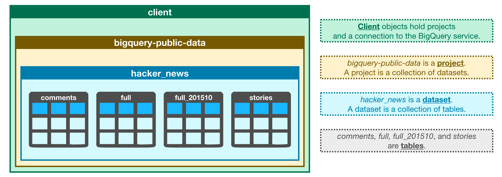

# Section 1 — BigQuery Basics

## Main idea

SQL is the language used to work with databases.

In this course, SQL queries are run on **BigQuery**.

**BigQuery** is a Google web service for querying very large datasets.

## BigQuery hierarchy

```text
Project
└── Dataset
    └── Table
        ├── Columns
        └── Rows
```



Example from the course:

```text
Project: bigquery-public-data
Dataset: hacker_news
Table: full
```

## BigQuery Client

```python
from google.cloud import bigquery

client = bigquery.Client()
```

The `client` object is used to access BigQuery datasets and tables.

## Dataset reference

```python
dataset_ref = client.dataset("hacker_news", project="bigquery-public-data")
dataset = client.get_dataset(dataset_ref)
```

`dataset_ref` points to the dataset.

`get_dataset()` fetches the dataset information from BigQuery.

## Listing tables

```python
tables = list(client.list_tables(dataset))

for table in tables:
    print(table.table_id)
```

This lists all tables inside the dataset.

In `hacker_news`, the tables are:

```text
comments
full
full_201510
stories
```

## Table reference

```python
table_ref = dataset_ref.table("full")
table = client.get_table(table_ref)
```

`table_ref` points to a specific table.

`get_table()` fetches information about that table.

## Schema

The schema is the structure of a table.

It tells us:

```text
column name
data type
whether NULL is allowed
description
```

Example:

```text
SchemaField('by', 'STRING', 'NULLABLE', "The username of the item's author.")
```

Meaning:

```text
column name: by
data type: STRING
NULL allowed: yes
description: username of the author

Can be used as table.schema[0][info_type] where info_type is one of: name, field_type, mode, description
```

## Previewing rows

```python
client.list_rows(table, max_results=5).to_dataframe()
```

This gets the first 5 rows from the table and converts them to a pandas DataFrame.

## Previewing selected columns

```python
client.list_rows(
    table,
    selected_fields=table.schema[:1],
    max_results=5
).to_dataframe()
```

`selected_fields` chooses which columns to show.

Important: `table.schema[:1]` means “first column in the schema”.

In this table, the first column is `title`, not `by`.


# Section 2 — Running SQL Queries in BigQuery

## BigQuery table path

In BigQuery, the table name is written as a full path:

```sql
`project.dataset.table`
```

Example:

```sql
FROM `bigquery-public-data.openaq.global_air_quality`
```

Use backticks around the full table path.

## Writing the query in Python

The SQL query is stored as a Python string:

```python
query = """
        SELECT city
        FROM `bigquery-public-data.openaq.global_air_quality`
        WHERE country = 'US'
        """
```

Triple quotes allow the SQL query to span multiple lines.

## Running the query

```python
client = bigquery.Client()

query_job = client.query(query)
result_df = query_job.to_dataframe()
```

Meaning:

```text
client.query(query)       → sends the SQL query to BigQuery
.to_dataframe()           → runs/fetches the result as a pandas DataFrame
```

After this, `result_df` can be used like a normal pandas DataFrame.

## Selecting from BigQuery tables

Example with one column:

```sql
SELECT city
FROM `bigquery-public-data.openaq.global_air_quality`
WHERE country = 'US'
```

Example with multiple columns:

```sql
SELECT city, country
FROM `bigquery-public-data.openaq.global_air_quality`
WHERE country = 'US'
```

Example with all columns:

```sql
SELECT *
FROM `bigquery-public-data.openaq.global_air_quality`
WHERE country = 'US'
```

## BigQuery scan limit

BigQuery can scan very large amounts of data.

On Kaggle, there is a free scan limit, so large queries should be checked before running.

## Dry run

A dry run estimates how much data the query will process without actually running it.

```python
dry_run_config = bigquery.QueryJobConfig(dry_run=True)

dry_run_query_job = client.query(
    query,
    job_config=dry_run_config
)

print(dry_run_query_job.total_bytes_processed)
```

## Maximum bytes billed

This prevents a query from running if it would scan too much data.

```python
ONE_GB = 1000 * 1000 * 1000

safe_config = bigquery.QueryJobConfig(
    maximum_bytes_billed=ONE_GB
)

safe_query_job = client.query(
    query,
    job_config=safe_config
)

result_df = safe_query_job.to_dataframe()
```

If the query needs more data than the limit, BigQuery cancels it.


# Section 3 — GROUP BY / COUNT in BigQuery

## Count rows in groups

Use `COUNT(1)` to count rows in each group.

```sql
SELECT parent, COUNT(1) AS NumPosts
FROM `bigquery-public-data.hacker_news.full`
GROUP BY parent
```

`COUNT(1)` is readable and can scan less data than counting a specific column.

## Filter grouped results

Use `HAVING` after `GROUP BY`.

```sql
SELECT parent, COUNT(1) AS NumPosts
FROM `bigquery-public-data.hacker_news.full`
GROUP BY parent
HAVING COUNT(1) > 10
```

`WHERE` filters rows before grouping.
`HAVING` filters groups after grouping.

## Alias aggregate columns

Without aliasing, BigQuery may name aggregate columns like `f0_`.

Use `AS`:

```sql
COUNT(1) AS NumPosts
```

## BigQuery run with byte limit

```python
safe_config = bigquery.QueryJobConfig(maximum_bytes_billed=10**10)

query_job = client.query(query, job_config=safe_config)

df = query_job.to_dataframe()
```

This prevents accidentally scanning too much data.

## GROUP BY rule

Every selected column must be either:

```text
in GROUP BY
or inside an aggregate function
```

Valid:

```sql
SELECT parent, COUNT(id)
FROM `bigquery-public-data.hacker_news.full`
GROUP BY parent
```

Invalid:

```sql
SELECT `by`, parent, COUNT(id)
FROM `bigquery-public-data.hacker_news.full`
GROUP BY parent
```

because `by` is not grouped or aggregated.

## Reserved keyword column names

`by` is a reserved SQL word, so in BigQuery it must be written with backticks:

```sql
SELECT `by` AS author
FROM `bigquery-public-data.hacker_news.full`
```
# Section 3 — GROUP BY / COUNT in BigQuery

## Count rows in groups

Use `COUNT(1)` to count rows in each group.

```sql
SELECT parent, COUNT(1) AS NumPosts
FROM `bigquery-public-data.hacker_news.full`
GROUP BY parent
```

`COUNT(1)` is readable and can scan less data than counting a specific column.

## Filter grouped results

Use `HAVING` after `GROUP BY`.

```sql
SELECT parent, COUNT(1) AS NumPosts
FROM `bigquery-public-data.hacker_news.full`
GROUP BY parent
HAVING COUNT(1) > 10
```

`WHERE` filters rows before grouping.
`HAVING` filters groups after grouping.

## Alias aggregate columns

Without aliasing, BigQuery may name aggregate columns like `f0_`.

Use `AS`:

```sql
COUNT(1) AS NumPosts
```

## BigQuery run with byte limit

```python
safe_config = bigquery.QueryJobConfig(maximum_bytes_billed=10**10)

query_job = client.query(query, job_config=safe_config)

df = query_job.to_dataframe()
```

This prevents accidentally scanning too much data.

## GROUP BY rule

Every selected column must be either:

```text
in GROUP BY
or inside an aggregate function
```

Valid:

```sql
SELECT parent, COUNT(id)
FROM `bigquery-public-data.hacker_news.full`
GROUP BY parent
```

Invalid:

```sql
SELECT `by`, parent, COUNT(id)
FROM `bigquery-public-data.hacker_news.full`
GROUP BY parent
```

because `by` is not grouped or aggregated.

## Reserved keyword column names

`by` is a reserved SQL word, so in BigQuery it must be written with backticks:

```sql
SELECT `by` AS author
FROM `bigquery-public-data.hacker_news.full`
```

# Section 4 — ORDER BY and Dates in BigQuery

## Sort results

Use `ORDER BY` near the end of the query.

```sql
SELECT column_name
FROM `project.dataset.table`
ORDER BY column_name
```

Descending order:

```sql
ORDER BY column_name DESC
```

## BigQuery date formats

`DATE`:

```text
YYYY-MM-DD
```

Example:

```text
2019-01-10
```

`DATETIME` / `TIMESTAMP` includes time too.

Example:

```text
2015-03-28 14:58:00+00:00
```

## Extract part of a date

Use `EXTRACT()`.

```sql
EXTRACT(part FROM date_column)
```

Examples:

```sql
EXTRACT(YEAR FROM timestamp_of_crash)
EXTRACT(MONTH FROM timestamp_of_crash)
EXTRACT(DAY FROM timestamp_of_crash)
EXTRACT(DAYOFWEEK FROM timestamp_of_crash)
```

## Essential BigQuery date/time functions

Extract one part:

```sql
EXTRACT(YEAR FROM date_column)
EXTRACT(MONTH FROM date_column)
EXTRACT(DAY FROM date_column)
EXTRACT(DAYOFWEEK FROM date_column)
EXTRACT(HOUR FROM timestamp_column)
```

Convert timestamp/datetime to date:

```sql
DATE(timestamp_column)
```

Current date/time:

```sql
CURRENT_DATE()
CURRENT_DATETIME()
CURRENT_TIMESTAMP()
```

Difference between dates:

```sql
DATE_DIFF(date1, date2, DAY)
DATE_DIFF(date1, date2, MONTH)
DATE_DIFF(date1, date2, YEAR)
```

Add/subtract time:

```sql
DATE_ADD(date_column, INTERVAL 7 DAY)
DATE_SUB(date_column, INTERVAL 1 MONTH)
```

Group by month/year:

```sql
DATE_TRUNC(date_column, MONTH)
DATE_TRUNC(date_column, YEAR)
```

Format date as text:

```sql
FORMAT_DATE('%Y-%m', date_column)
```

Parse text into date:

```sql
PARSE_DATE('%Y-%m-%d', text_column)
```

Most common pattern:

```sql
SELECT
    EXTRACT(YEAR FROM timestamp_column) AS year,
    COUNT(1) AS row_count
FROM `project.dataset.table`
GROUP BY year
ORDER BY year
```

## Group by extracted date part

Example: count accidents by day of week.

```sql
SELECT 
    COUNT(consecutive_number) AS num_accidents,
    EXTRACT(DAYOFWEEK FROM timestamp_of_crash) AS day_of_week
FROM `bigquery-public-data.nhtsa_traffic_fatalities.accident_2015`
GROUP BY day_of_week
ORDER BY num_accidents DESC
```

## DAYOFWEEK meaning in BigQuery

```text
1 = Sunday
2 = Monday
3 = Tuesday
4 = Wednesday
5 = Thursday
6 = Friday
7 = Saturday
```

## Run with byte limit

```python
safe_config = bigquery.QueryJobConfig(maximum_bytes_billed=10**9)

query_job = client.query(query, job_config=safe_config)

df = query_job.to_dataframe()
```


# Section 5 — AS and WITH in BigQuery

## Alias column names

Use `AS` to rename output columns.

```sql
SELECT COUNT(1) AS Number
FROM `project.dataset.table`
```

Useful for aggregate columns, because otherwise BigQuery may return names like `f0_`.

## Alias selected values

```sql
SELECT DATE(block_timestamp) AS trans_date
FROM `bigquery-public-data.crypto_bitcoin.transactions`
```

`trans_date` becomes the new column name in the result.

## Common Table Expression / CTE

Use `WITH ... AS` to create a temporary table inside one query.

```sql
WITH temp_table AS (
    SELECT column_name
    FROM `project.dataset.table`
)
SELECT *
FROM temp_table
```

A CTE exists only inside that query.

## BigQuery example with CTE

```sql
WITH time AS (
    SELECT DATE(block_timestamp) AS trans_date
    FROM `bigquery-public-data.crypto_bitcoin.transactions`
)
SELECT 
    COUNT(1) AS transactions,
    trans_date
FROM time
GROUP BY trans_date
ORDER BY trans_date
```

## Why use CTEs

CTEs make long queries easier to read.

They also allow simple cleaning/transformation before the final query.

Example:

```text
Step 1: create cleaned temporary table
Step 2: query from that temporary table
```

## BigQuery note

For large datasets, doing cleaning inside SQL/BigQuery is usually faster than fetching raw data first and cleaning everything in Pandas.


# Section 6 — JOIN in BigQuery

## Join two tables

Use `INNER JOIN` to combine rows from two tables when matching values exist in both tables.

```sql
SELECT 
    table1.column_name,
    table2.column_name
FROM `project.dataset.table1` AS table1
INNER JOIN `project.dataset.table2` AS table2
    ON table1.matching_column = table2.matching_column
```

## Table aliases

Use short aliases to make long BigQuery table names easier to read.

```sql
FROM `bigquery-public-data.github_repos.sample_files` AS sf
INNER JOIN `bigquery-public-data.github_repos.licenses` AS L
```

Then use:

```sql
sf.repo_name
L.repo_name
L.license
```

## ON condition

`ON` tells BigQuery how to match the two tables.

```sql
ON sf.repo_name = L.repo_name
```

This means rows are joined when the `repo_name` values are the same.

## BigQuery JOIN example

```sql
SELECT 
    L.license,
    COUNT(1) AS number_of_files
FROM `bigquery-public-data.github_repos.sample_files` AS sf
INNER JOIN `bigquery-public-data.github_repos.licenses` AS L
    ON sf.repo_name = L.repo_name
GROUP BY L.license
ORDER BY number_of_files DESC
```

## Meaning of the example

```text
sample_files table → file information
licenses table     → repo license information
repo_name          → common column used to match tables
```

The query counts how many files belong to each license.

## Good habit

When using joins, write column names with table aliases:

```sql
L.license
sf.repo_name
```

This avoids confusion when two tables have columns with the same name.
